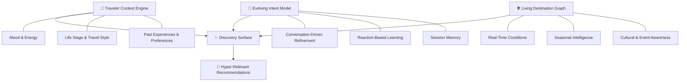
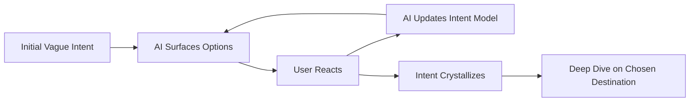

# 🌍 AI-Native Travel Discovery — Product Ideation

## The Problem We're Solving

Today's travel discovery is fundamentally broken in three ways:

| Problem | Current State | What Travelers Actually Need |
|---|---|---|
| **Generic recommendations** | "Top 10 beaches" lists that ignore who you are | Deeply personalized suggestions that *feel like they were made for you* |
| **Filter-heavy UX** | 47 dropdowns: budget, dates, star rating, amenities... | A system that *understands intent* without interrogating the user |
| **Static intent** | You search → you get results → done | A system that evolves *with* the traveler as their thinking shifts |

> [!IMPORTANT]
> **Core Insight**: Travelers often don't know what they want until they see it. The system shouldn't ask "where do you want to go?" — it should help them *discover* where they want to go.

---

## Core Concept: "Wanderlust Engine"

An AI travel companion that models **who you are**, not just **what you searched for**.

### The Three Pillars



---

## Feature Brainstorm

### 1. 🎭 **Mood-First Discovery** (Entry Point)

Instead of "Where do you want to go?", the system opens with:

> *"What kind of experience are you craving?"*

- Visual mood board UI — user taps on images/vibes that resonate
- Spectrum sliders: `Adventure ↔ Relaxation`, `Solo ↔ Social`, `Culture ↔ Nature`, `Budget ↔ Luxury`
- Free-text input: *"I just finished a stressful project and want somewhere I can completely unplug for a week"*
- The AI interprets this holistically — not as keyword search, but as **intent understanding**

**Why this matters**: A stressed parent of two toddlers saying "I need a break" means something radically different than a 23-year-old solo backpacker saying the same thing.

---

### 2. 🧬 **Traveler DNA Profile**

A persistent, evolving profile that captures who you are as a traveler — built over time, not through a quiz.

| Signal | How It's Captured |
|---|---|
| Travel style | Past trips, reactions to suggestions, stated preferences |
| Sensory preferences | "Loves street food", "hates crowds", "morning person" |
| Life context | Traveling with kids, honeymoon, sabbatical, remote worker |
| Budget comfort zone | Inferred from past choices + stated constraints |
| Hidden preferences | Things the user doesn't know to ask for — discovered by the AI |

> [!TIP]
> **Key Differentiator**: The profile isn't a static form. It's a living model that the AI references and updates with every interaction. Think Spotify's taste profile, but for travel.

---

### 3. 💬 **Conversational Discovery Flow**

A chat-based interface where the AI acts as a knowledgeable travel companion — not a search engine.

**Sample Interaction Flow:**
```
User: "I want to go somewhere in September, maybe Europe. 
       Something off the beaten path."

AI:   "September is gorgeous for that. A few directions we could explore:

       🏔️ The Azores — volcanic islands, dramatic landscapes, 
          very few tourists in shoulder season
       🍷 Georgia (the country) — ancient wine culture, stunning 
          Caucasus mountains, incredibly affordable
       🏘️ Slovenia's Soča Valley — emerald rivers, alpine villages, 
          adventure sports without the Swiss crowds
       
       Any of these spark something? Or should I explore a 
       different vibe?"

User: "The Azores sounds interesting but I also want good food"

AI:   "Great instinct. The Azores actually have a fascinating food 
       scene — volcanic-cooked stews (cozido), fresh seafood, local 
       cheeses. But if food is a primary driver, let me also 
       suggest..."
```

**Key behaviors:**
- Proactive suggestion with reasoning (not just a list)
- Asks follow-up questions that *narrow intelligently*
- Remembers the full conversation context
- Surfaces things the user wouldn't have thought to search for

---

### 4. 🗺️ **Visual Exploration Canvas**

A map-meets-moodboard interface for non-linear discovery:

- **Interactive map** with AI-annotated regions ("This area matches your vibe")
- **Card-based destinations** that can be swiped (like/pass/save) — the AI learns from reactions
- **Comparison view**: Side-by-side destination comparisons on dimensions the user cares about
- **"Surprise Me" mode**: The AI picks something unexpected but justified by your profile
- **Seasonal overlays**: Show what's optimal *right now* vs. your travel dates

---

### 5. 🔄 **Evolving Intent Loop**

The system models that intent changes *during* the discovery process.



**Concrete mechanisms:**
- **Reaction tracking**: What they click, hover on, dismiss, save, or compare
- **Pivot detection**: "Actually, I think I want beaches instead" → AI smoothly shifts
- **Confidence scoring**: The AI shows its confidence in each suggestion and *why*
- **Session memory**: Come back in 3 days, and the AI picks up exactly where you left off

---

### 6. 📅 **Context-Aware Trip Shaping**

Once a destination is chosen, the AI shifts into trip-shaping mode:

- **Smart itinerary generation** based on traveler DNA + destination knowledge
- **Pace matching**: "You prefer slow mornings" → no 7am activities
- **Hidden gems injection**: Mix of must-sees and unexpected finds
- **Logistics awareness**: Visa requirements, travel advisories, flight availability, local holidays
- **Group dynamics**: Traveling with a partner who has different preferences? The AI balances both profiles

---

### 7. 🌡️ **Real-Time Destination Intelligence**

The "living" layer that makes recommendations timely, not just relevant:

- Current weather patterns & forecasts
- Local events, festivals, and cultural moments
- Crowd levels and tourism seasonality
- Recent traveler sentiment (not just star ratings — *narrative* reviews)
- Safety and health advisories
- Currency/cost trends

---

### 8. 📸 **Social Proof That Actually Helps**

Rethinking reviews and social proof:

- **Story-based reviews**: Instead of star ratings, surface narrative snippets from travelers *like you*
- **"Travelers like you loved..."**: Collaborative filtering based on traveler DNA similarity
- **Photo intelligence**: AI-curated photos that show the *real* experience, not the Instagram version
- **Timing intelligence**: "People who went in September said..." 

---

## Potential V1 Feature Set (MVP Scope)

> [!NOTE]
> A strong V1 should nail the **discovery experience** end-to-end for a single traveler. Trip planning and booking can come later.

### Must-Have for V1
| Feature | Rationale |
|---|---|
| **Conversational discovery** | Core differentiator — this IS the product |
| **Mood-first entry point** | Replaces the cold "search bar" with warmth |
| **Traveler context capture** | Even a lightweight version (mood + constraints + life stage) |
| **Visual destination cards** | Tangible output the user can react to |
| **Evolving session memory** | The AI must get smarter within a single session |
| **Destination deep-dives** | When a user says "tell me more", deliver richly |

### Nice-to-Have for V1
| Feature | Rationale |
|---|---|
| Persistent traveler profile | Valuable but requires auth + storage |
| Map-based exploration | Rich UX but complex to build |
| Real-time data integration | Powerful but adds API dependencies |
| Group travel support | Multiplies complexity |

### V2+ Roadmap Ideas
- Full trip itinerary generation
- Booking integration (flights, hotels, experiences)
- Social features (share discoveries with travel buddies)
- AR/VR destination previews
- Post-trip reflection that feeds back into the profile

---

## User Personas to Design For

### 1. **"The Dreamer"** — *Sarah, 29, marketing manager*
- Scrolls travel Instagram at 11pm but never books anything
- Overwhelmed by choice, doesn't know where to start
- **Needs**: Inspiration that feels personal, not generic. A nudge from dreaming to doing.

### 2. **"The Optimizer"** — *Raj, 35, software engineer*
- Opens 47 browser tabs comparing destinations
- Wants data but drowns in it
- **Needs**: Intelligent synthesis. "Given everything you care about, here's the answer."

### 3. **"The Spontaneous One"** — *Mika, 26, freelancer*
- "I have 10 days off starting next week, where should I go?"
- Values novelty and serendipity
- **Needs**: Speed, surprise, and just enough planning to not get stranded.

### 4. **"The Life-Stage Traveler"** — *David & Priya, early 40s, two kids*
- Travel looks completely different now than 10 years ago
- Need kid-friendly but don't want *only* kid stuff
- **Needs**: A system that understands the constraints without making travel feel like a compromise.

---

## Product Name Ideas

| Name | Vibe |
|---|---|
| **Wandr** | Exploration, wanderlust, modern |
| **Driftmap** | Organic discovery, visual |
| **Compass AI** | Guidance, intelligence |
| **Roamly** | Friendly, approachable |
| **Voya** | Journey (voyage), clean |
| **Serendrift** | Serendipity + drift |

---

## Open Questions for Discussion

1. **Depth vs. Breadth**: Should V1 focus on a specific travel type (e.g., international leisure) or try to handle all travel?
2. **Data Sources**: What destination/experience data do we ground the AI in? Curated database vs. web-scale data vs. hybrid?
3. **Monetization Model**: Affiliate bookings? Premium features? B2B to travel companies?
4. **Platform**: Web-first? Mobile-first? Both?
5. **AI Architecture**: Single LLM conversation? Multi-agent system with specialized agents (destination expert, logistics expert, etc.)?
6. **Cold Start**: How do we make the very first interaction magical before we know anything about the user?
