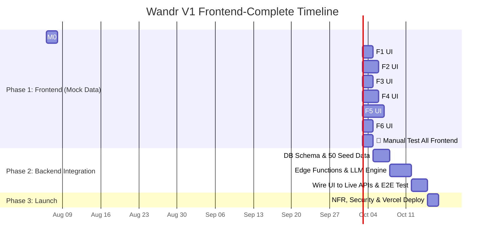

# Wandr V1 — Implementation Plan (Frontend-Complete First Approach)

> **Source Documents:** [PRD_Wandr_V1.md](file:///d:/Product%20Space/AI%20Sprint%201/docs/PRD_Wandr_V1.md) + [test_cases_wandr_v1.md](file:///d:/Product%20Space/AI%20Sprint%201/docs/test_cases_wandr_v1.md)
> 
> **Excluded:** `v1_feature_spec.md` (describes a different/future product)

---

## 🎯 Core Execution Rule

```mermaid
graph TD
    subgraph "PHASE 1: Complete Frontend First (Feature-by-Feature)"
        M0[M0: Project Shell & Mock Layer] --> F1[F1 UI: Mood Entry]
        F1 --> T1[🧪 Test F1 UI]
        T1 --> F2[F2 UI: Conversational Engine]
        F2 --> T2[🧪 Test F2 UI]
        T2 --> F3[F3 UI: Traveler Context & Negatives]
        F3 --> T3[🧪 Test F3 UI]
        T3 --> F4[F4 UI: Destination Cards & Reactions]
        F4 --> T4[🧪 Test F4 UI]
        T4 --> F5[F5 UI: Deep-Dives & Budget Intel]
        F5 --> T5[🧪 Test F5 UI]
        T5 --> F6[F6 UI: Evolving Intelligence & Session UX]
        F6 --> T6[🧪 Test F6 UI]
    end

    subgraph "PHASE 2: Full Backend Integration"
        T6 --> B1[Database Schema & 50 Destination Seed Data]
        B1 --> B2[Supabase 48h Session Engine]
        B2 --> B3[Conversational LLM Engine & RAG Retrieval]
        B3 --> B4[Wire Frontend to Live Backend & API Endpoints]
        B4 --> B5[🧪 End-to-End Test Gate (All 49 Test Cases)]
    end

    subgraph "PHASE 3: Polish & Launch"
        B5 --> P1[Security, Anti-Hallucination & NFR Hardening]
        P1 --> P2[🚀 Deployment to Vercel]
    end
```

---

## Phase 1: Frontend Development & UI Manual Testing (Feature by Feature)

In Phase 1, we build the entire frontend using a rich, reactive **mock data layer**. Every interaction, animation, modal, chat state, and card reaction will work visually and statefully on the client. We build and manually test one feature UI at a time.

---

### Feature 0: Project Bootstrap & Mock Infrastructure
**Scope:**
- Initialize Next.js 14+ (App Router), TypeScript, Tailwind CSS v4, Framer Motion, Zustand.
- Create shared UI library (Buttons, Modals, Cards, Badges, Tooltips, Skeletons, Toasts).
- Build App Shell & Layout (Landing Page, Conversational Interface, Drawer/Sidebar).
- Setup `mockData.ts` containing 10 rich destination records, mock conversation threads, and mock AI responses.

---

### Feature 1 UI: Mood-First Discovery Entry 🎭
**Test Suite:** Suite 1 (TC-101 to TC-105)

**Build (Frontend):**
1. Full-screen landing page hero (*"What kind of escape are you dreaming of?"*).
2. Cycling inspirational prompt chips (tap-to-fill and submit).
3. Visual Mood Selector: 8–12 tiles (🏔️ Wild & Untamed, 🍷 Culture & Cuisine, etc.), multi-select 1–3, combinable with text.
4. Input validation (gentle inline hint for < 3 words, no hard blocking).
5. Transition animation from landing to conversational view on submit.
6. Optional constraint follow-up prompts with "I'm flexible / Skip" quick replies.
7. Origin city prompt UI when budget is provided.

**🧪 Manual Test Gate (Feature 1 UI):**
- Verify TC-101 (Free text entry & smooth transition)
- Verify TC-102 (Short input hint)
- Verify TC-103 (Example prompt chip auto-fill)
- Verify TC-104 (Visual tiles multi-select + free text combined)
- Verify TC-105 (Skipping constraints)

---

### Feature 2 UI: Conversational Discovery Engine 💬
**Test Suite:** Suite 2 (TC-201 to TC-206)

**Build (Frontend):**
1. Streaming chat UI (token-by-token typing animation, message history).
2. Destination cards rendered inline in chat responses.
3. Card details: hero image, title/region, vibe tag, "Why this matches you" rationale, quick stats pill (Best Time \| Daily Cost \| Flight Time), curiosity hook.
4. Smart follow-up question pills (max 2 consecutive questions before surfacing cards).
5. Epistemic uncertainty badge display on cards/text for low-confidence data.
6. Source grounding badge ("Verified by Layer 1 KB").

**🧪 Manual Test Gate (Feature 2 UI):**
- Verify TC-201 (Exactly 3–4 cards per response)
- Verify TC-202 (Rationale + curiosity hook presence)
- Verify TC-203 (Factual layout correctness against mock data)
- Verify TC-204 (Max 2 consecutive AI follow-up questions)
- Verify TC-205 (Personalized rationale display)
- Verify TC-206 (Uncertainty marker rendering)

---

### Feature 3 UI: Traveler Context & Negative Preferences 🧬
**Test Suite:** Suite 3 (TC-301 to TC-305)

**Build (Frontend):**
1. Context-aware UI states (Solo, Couple, Family with Toddler/Stroller, Digital Nomad).
2. Context correction trigger in chat (e.g. "kids aren't coming, just anniversary" updates UI badge/context).
3. Travel Style calibration summary card (rendered after 3 turns for user confirmation).
4. Negative preference filter indicator (showing active excluded categories).
5. Implicit negative UI handler (detecting 2 dismissals of same type and updating UI state).

**🧪 Manual Test Gate (Feature 3 UI):**
- Verify TC-301 (Family/Stroller context rendering)
- Verify TC-302 (Real-time context correction UI update)
- Verify TC-303 (Travel style reflection card display)
- Verify TC-304 (Negative constraint display)
- Verify TC-305 (Implicit negative learning feedback)

---

### Feature 4 UI: Destination Cards & Card Reactions 🃏
**Test Suite:** Suite 4 (TC-401 to TC-405)

**Build (Frontend):**
1. Micro-interaction buttons on cards (< 100ms visual response):
   - ❤️ Interested
   - ✖️ Not for me (Dismiss)
   - 🔖 Save
2. Dismiss card flow: smooth exit animation → micro-chips ("Too expensive? Too far? Not the vibe?") -> updates local state.
3. Saved Destinations drawer/side panel with active badge counter.
4. Side-by-Side Destination Comparison View (modals comparing 2–3 saved places across cost, transit, season, vibe match + AI synthesis block).
5. Mobile responsive stacking (touch targets ≥ 44×44px, zero horizontal overflow at 375px).

**🧪 Manual Test Gate (Feature 4 UI):**
- Verify TC-401 (Card visual structure & stats pill)
- Verify TC-402 (Responsive layout on 375px, 768px, 1280px)
- Verify TC-403 (Save action & saved drawer sync)
- Verify TC-404 (Dismiss animation & micro-chip workflow)
- Verify TC-405 (Side-by-side comparison modal UI)

---

### Feature 5 UI: Destination Deep-Dives & Budget Intelligence 🔍💰
**Test Suite:** Suite 6 & Suite 7 (TC-601 to TC-605, TC-701 to TC-706)

**Build (Frontend):**
1. Full Deep-Dive slide-over sheet / modal (7 sections):
   - Hero photo gallery (4–6 photos with thumbnail strip)
   - Personalized AI summary
   - "Best For" tags & Season breakdown
   - Budget guide & Getting There info
   - ✅ "Why You'll Love It" (tailored to context)
   - ⚠️ "What to Know" (honest drawbacks — min 2 points)
   - 5–8 Curated Experience Highlights cards with category tags
2. Total-Budget Duration Optimizer display widget (*"X days here vs Y days there for $[Budget]"*).
3. Transit vs. Ground Cost Split Badge (`✈️ $$$ | 🏨 $`) with hover/tap breakdown popup.
4. Mandatory Hidden Financial Burden Warning callouts in deep-dive (tourist tax, airport transfer costs).
5. Share discovery modal (read-only preview mode + copy link UI).
6. Stale data disclaimer banner (for records > 180 days old).

**🧪 Manual Test Gate (Feature 5 UI):**
- Verify TC-601 (Deep-dive modal structure & layout)
- Verify TC-602 (Personalized overview rendering)
- Verify TC-603 ("What to Know" honest pros/cons UI)
- Verify TC-604 (Experience highlights cards display)
- Verify TC-605 (Share discovery link UI)
- Verify TC-701 (Budget duration optimizer widget UI)
- Verify TC-702 (Low-budget warning alert display)
- Verify TC-703 (Cost split badge rendering & tap breakdown)
- Verify TC-704 (Hidden fee alert callouts)
- Verify TC-705 (Origin location prompt trigger)
- Verify TC-706 ("Too expensive" dismissal cost tier shift UI)

---

### Feature 6 UI: Evolving Session Intelligence & Session Recovery UX 🔄
**Test Suite:** Suite 5 (TC-501 to TC-505)

**Build (Frontend):**
1. Preference refinement visual indicator (showing AI adapting to choices over 4+ turns).
2. Conversational pivot UI (acknowledging topic shifts smoothly).
3. Intent crystallization mode UI (transitioning from broad discovery to destination focus mode).
4. Session UUID URL routing (`/discover/[session-uuid]`).
5. Session restoration UI (restoring chat, cards, and saved drawer state from local/Zustand storage).
6. Expired session UI banner and redirect flow.

**🧪 Manual Test Gate (Feature 6 UI):**
- Verify TC-501 (Reaction-based preference feedback)
- Verify TC-502 (Conversational pivot UX)
- Verify TC-503 (Intent crystallization mode shift)
- Verify TC-504 (Session URL state restoration)
- Verify TC-505 (Expired session state flow)

---

## 🚦 PHASE 1 COMPLETION GATE
> **Milestone check:** All 6 feature UIs built, styled, animated, responsive, and manually tested by you with mock data. Once you give 100% approval on the complete UI experience, we move to Phase 2!

---

## Phase 2: Full Backend Integration & Real Data Engine

Once the complete frontend is tested and verified, we build and wire up the backend services:

| # | Backend Component | Details |
|---|-------------------|---------|
| 1 | **Database Setup (Supabase PostgreSQL)** | Create `destinations`, `sessions`, `session_reactions`, `shares` schema. |
| 2 | **50 Destination Seed Data** | Populate Database with 50 curated, real-world destinations including verified transit matrices, budget tiers, seasonal breakdown, hidden fees, and images. |
| 3 | **Conversational LLM Engine** | Set up Edge Functions to handle multi-turn dialogue, intent extraction, RAG querying against Layer 1 KB, and SSE streaming token responses. |
| 4 | **48-Hour Session Engine** | UUIDv4 session creation, preference state persistence, 48h TTL, share token generation. |
| 5 | **Budget & Cost Engine** | Real calculation for `(Budget - Transit) / Daily Ground Cost` and cost split badges based on user origin. |
| 6 | **Frontend-to-Backend Wiring** | Replace all `mockData.ts` calls in Zustand stores with real Supabase client and Edge Function APIs. |

**🧪 Manual Test Gate (End-to-End Live System):**
Re-run all 49 test cases against live LLM, live database, and real streaming responses.

---

## Phase 3: Polish, Security & Deployment

| # | Task | Test Cases |
|---|------|------------|
| 1 | **Streaming Latency Optimization** | Verify TTFT < 5s on Fast 4G (`TC-NFR-801`) |
| 2 | **CDN & Image Load Performance** | Compressed WebP/AVIF images < 200KB (`TC-NFR-802`) |
| 3 | **Accessibility Audit** | WCAG 2.1 AA keyboard nav, ARIA tags (`TC-NFR-803`) |
| 4 | **Anti-Hallucination & Prompt Security** | Guardrails against fake places (`TC-SEC-901`), prompt injection (`TC-SEC-902`), PII scrubbing (`TC-SEC-905`) |
| 5 | **Fallback Reliability** | LLM timeout fallback to static curated cards (`TC-NFR-805`) |
| 6 | **Production Deployment** | Deploy finished application to **Vercel** with custom environment variables. |

---

## Summary Timeline



**Total Duration: ~28–30 working days**
