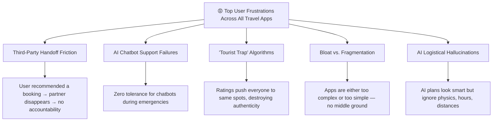
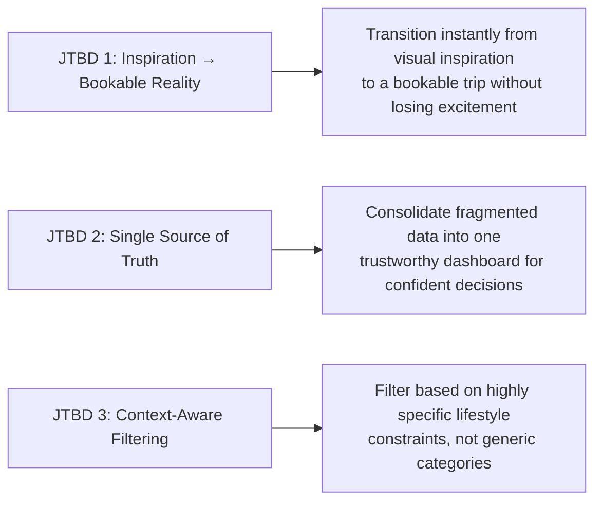

# 🧭 Wandr — Product Discovery Report

> **Product**: Wandr — An AI-native travel discovery platform that deeply understands traveler context and proactively surfaces highly relevant destinations and experiences.
> **Date**: August 2, 2026
> **Status**: Product Discovery Phase

---

## Executive Summary

This report synthesizes findings from four parallel research streams to validate the opportunity for Wandr and inform product strategy:

| Research Stream | Key Finding |
|---|---|
| 🏢 **Competitive Landscape** | The market splits into "quick chat AI" vs. "complex dashboard planners" — nobody owns the **inspiration-to-action** middle ground |
| 📱 **App Review Sentiment** | Travelers are frustrated by fake reviews, logistics failures, third-party handoff friction, and AI hallucinations |
| 📊 **Market & Trends** | $1.27B generative AI travel market in 2026, with social-first discovery and "mood over destination" as dominant behavioral shifts |
| 🎙️ **Persona Interviews** | All 4 personas suffer from "tab explosion" and the logistics chasm — the gap between dreaming and booking is where everyone drops off |

> [!IMPORTANT]
> **The Core Opportunity**: No product today owns the full journey from *"I don't know where I want to go"* → *"I just booked the perfect trip."* Wandr can be the first AI-native platform to close this gap by modeling evolving traveler intent, not just answering search queries.

---

## Part 1: Competitive Landscape

### 1.1 AI-Native Travel Tools (Direct Competitors)

| Competitor | Approach | Strengths | Weaknesses |
|---|---|---|---|
| **Layla AI** (acquired Roam Around) | Chat-first, video inspiration, multi-modal | Handles fuzzy requests; eliminates tab-juggling | Weak on complex multi-city logistics |
| **Trip Planner AI / Wanderlog / Mindtrip** | Dashboard-driven, maps, drag-drop calendars | Excellent for complex trips; collaborative | High friction entry; steep learning curve |
| **GuideGeek** | Messaging on WhatsApp/IG/Messenger | Zero friction; great for in-the-moment questions | No persistent itineraries; poor offline; no memory |
| **PLAN by ixigo / iPlan.ai** | Regional planners within OTA frameworks | Strong regional data; logical day-by-day output | Not inspirational; rigid format |

### 1.2 Traditional Platforms (Indirect Competitors)

| Platform | Discovery Handling | What's Broken |
|---|---|---|
| **Google Travel** | Search & map-based grids | Purely utilitarian; zero inspiration; redirect-only booking |
| **Skyscanner / Kayak** | Deep filtering, price alerts | Cluttered UX; redirects to obscure OTAs with no support |
| **TripAdvisor** | Community reviews & forums | Clunky UX; overwhelming outdated reviews; trust erosion |
| **Booking.com / Airbnb** | Accommodation-first search | Anxiety-inducing urgency patterns; hidden fees; AI-only support |

### 1.3 Social & Content-Driven Discovery

- **TikTok & Instagram** have functionally replaced Google for travel inspiration — the shift from "likes" to "saves" signals high booking intent
- **Reddit r/travel** is the "anti-influencer" hub for vetting destinations and finding authentic advice
- **2026 trend**: Authenticity > Polish. UGC, raw vlogs, and niche community travel drive decisions

### 1.4 Emerging Players (2025-2026)

- **Stardrift**: Hyper-personalized, memory-based trip planning integrated with life constraints and calendar
- **DAIS (DareAISearch)**: Infrastructure play helping travel brands optimize for AI search engines
- **myPlane & Axelrod**: B2B AI-native operations (charter flights, hotel ops)

### 1.5 Competitive Positioning Map

```
                    LOGISTICS / BOOKING
                          ▲
                          │
      Layla AI ●          │        ● Google Travel
      GuideGeek ●         │        ● Kayak / Skyscanner
                          │        ● Trip Planner AI
                          │        ● Wanderlog
    ──────────────────────┼─────────────────────────►
    CONVERSATIONAL        │               DASHBOARD
                          │
                          │        ● TripAdvisor
      TikTok/IG ●        │        ● Pinterest
      (fragmented)        │
                          │
                    INSPIRATION
```

> [!TIP]
> **Wandr's Whitespace**: The bottom-left quadrant — **Conversational + Inspirational** — is underserved. TikTok/IG generate inspiration but can't convert to bookings. Wandr can own the **"Mood-to-Map Pipeline"**: take a user's mood/intent via chat → generate visual, TikTok-style inspiration → seamlessly convert to a structured itinerary once intent crystallizes.

---

## Part 2: App Store & Review Sentiment Analysis

### 2.1 App-by-App Highlights

| App | What Users Love | What Users Hate |
|---|---|---|
| **TripAdvisor** | Vast photo database, price comparison | Fake reviews, pay-to-play results, AI summaries that hide negatives |
| **Google Travel** | Convenience, Gmail sync, price tools | Ratings create "tourist traps"; fragmented booking handoff |
| **Skyscanner** | Cheap route finding | Third-party booking nightmares; price bait-and-switch |
| **Booking.com** | Straightforward interface | AI chatbot black hole; host misconduct; refund failures |
| **Airbnb** | Intuitive UI, unique stays | Hidden cleaning fees; listing discrepancies; bad dispute resolution |
| **Lonely Planet** | Trusted, curated content | Lost practicality (bus schedules, budget info); killed community forum |
| **AI Travel Apps** (Layla, Roam) | Great for the "blank page" problem | **Logistical hallucinations** — closed businesses, impossible transit times |
| **TripIt** | Gold standard for itinerary aggregation | False alerts causing panic; email parsing errors |
| **Wanderlog** | Best-in-class map planning, collaboration | Performance crashes on complex trips; aggressive paywalls |
| **Culture Trip** | Inspiring hidden gem content | Technical bugs; removed booking features; just a content reader now |

### 2.2 Cross-App Sentiment Themes



### 2.3 Top 10 Unmet Needs (From Reviews)

| # | Unmet Need | Wandr Opportunity |
|---|---|---|
| 1 | **Unified accountability** — platform backs the user when bookings go wrong | Build trust through curated, vetted partners |
| 2 | **Upfront, transparent pricing** — no hidden fees at checkout | Show real costs in discovery, not just at checkout |
| 3 | **Anti-algorithmic discovery** — bypass tourist traps for genuine local finds | Core differentiator: mood + AI surfacing hidden gems |
| 4 | **Logistics-aware AI** — plans that respect physics, hours, distances | Ground AI in real-world constraint data |
| 5 | **One-tap emergency human support** | V2+ but a massive trust builder |
| 6 | **Seamless discovery-to-booking** — no data loss or sketchy redirects | Own the full funnel |
| 7 | **Anxiety-free real-time alerts** — no false alarms | Build with verified data sources only |
| 8 | **Trustworthy reviews** — can't be gamed by bots or payments | Reddit-style sentiment + AI verification |
| 9 | **High-performance itinerary engine** — no crashes on complex trips | Invest in engineering from day one |
| 10 | **Peer-to-peer knowledge** — modern revival of travel forums | Community layer in V2+ |

---

## Part 3: Market & Trend Analysis

### 3.1 Market Sizing

| Level | Value (2025-2026) | Growth |
|---|---|---|
| **TAM** — Online Travel Market | $622B–$761B | → $1.4–$2T by 2034 (CAGR 7.4–11.1%) |
| **SAM** — Travel Technology Market | $11.3B–$14.3B | CAGR 5.3–10.3% |
| **SOM** — AI in Travel | $3.7B–$4.3B | Rapid growth |
| **SOM (specific)** — Generative AI in Travel | **$1.27B** (2026) | High CAGR, nascent market |

> [!NOTE]
> The generative AI travel market at $1.27B is early-stage and growing fast — perfect timing for Wandr to establish category leadership before the market consolidates.

### 3.2 Behavioral Trends Shaping Wandr

| Trend | Implication for Wandr |
|---|---|
| **AI as starting point** | Travelers asking AI broad questions, not googling destinations → validates conversational-first UX |
| **Social commerce** | TikTok/IG → booking gap closing → Wandr should feel visual/social, not utilitarian |
| **Intentional travel** | "Calmcations," secondary cities, mood-first → validates mood-based discovery over destination search |
| **Slow travel** | Longer stays, deeper immersion → Wandr should support flexible trip lengths, not just 7-day packages |
| **Experiential over sightseeing** | Cooking classes, farm visits > checklist tourism → Wandr should surface experiences, not just places |

### 3.3 Demographic Segments

| Segment | Market Size | Key Behavior | Wandr Fit |
|---|---|---|---|
| **Gen Z** | Digital-first, TikTok-driven | Spontaneous, AI-comfortable, sustainability-conscious | ★★★★★ Perfect fit |
| **Millennials** | Highest spending power | Pragmatic explorers, driving family + multi-gen travel | ★★★★☆ Strong fit |
| **Solo Travelers** | $482B market (13.5% CAGR) | Self-discovery, social media normalized | ★★★★★ Perfect fit |
| **Family Travel** | ~$1.2T market | Multi-gen trips, "kidfluence" in destination selection | ★★★★☆ Strong fit (with context modeling) |

### 3.4 Technology Readiness

- **Agentic AI** is maturing — AI can now autonomously manage complex workflows, not just generate text
- **Investor sentiment** shifting from consumer AI hype to products with real utility and retention
- **Hyper-personalization engines** are now standard — table-stakes, not differentiator

---

## Part 4: Simulated User Interviews

### 4.1 Persona Snapshots

````carousel
### 🎭 The Dreamer — Sarah, 29

**Current behavior**: Saves hundreds of TikToks/Reels into a folder called "Someday." Last trip was planned entirely by a friend.

**Core frustration**: *"The 'Reel vs. Real' problem. I see a beautiful place online, but when I try to figure out how to actually get there, it's a nightmare."*

**Magic wand**: *"I want to feed it my Instagram 'Saved' folder, tell it my exact budget and dates, and have it say: 'Here is the exact trip. Click one button to book everything.'"*

**Deal breaker**: *"If it gives me a giant list of 50 hotels to choose from. I don't want a search engine; I want a curator."*

**Willingness to pay**: $20–30 per trip (one-time curation fee, not subscription)
<!-- slide -->
### 🔬 The Optimizer — Raj, 35

**Current behavior**: Treats trip planning like a project sprint. Builds massive spreadsheets. Cross-references Reddit, TripAdvisor, and hotel direct sites. ~20 hours per trip.

**Core frustration**: *"Data fragmentation. There is no single source of truth. Everything is rated 4.5 stars, which is statistically impossible."*

**Magic wand**: *"An aggregator of aggregators, with a customizable weighting system. 'Maximize proximity to transit, minimize cost, pull sentiment analysis from Reddit.'"*

**Deal breaker**: *"Black-box AI recommendations. If it doesn't show me WHY or link the raw data, I won't trust it."*

**Willingness to pay**: $50/year for premium
<!-- slide -->
### ⚡ The Spontaneous One — Mika, 26

**Current behavior**: Sees a cheap flight alert or TikTok, books within days. Figures out the rest on the ground via hostel word-of-mouth and local WhatsApp groups.

**Core frustration**: *"Logistics are a buzzkill. Traditional travel sites want you to lock in an exact 7-day itinerary. That's not how I travel."*

**Magic wand**: *"A 'Vibe Matcher' that works in real-time. I open it when I land, and it says, 'Based on your love for indie art and cheap beer, here are three neighborhoods to wander around right now.'"*

**Deal breaker**: *"If it recommends the Hard Rock Cafe, I'm deleting the app."*

**Willingness to pay**: Commission on logistics (transit, SIM cards) — not subscription
<!-- slide -->
### 👨‍👩‍👧‍👦 The Life-Stage Travelers — David & Priya, early 40s

**Current behavior**: Default to all-inclusive resorts because planning with kids is exhausting. Rely on "mom blogs" and Facebook groups over TripAdvisor.

**Core frustration**: *"Travel sites think 'family-friendly' means a kids' club and a Mickey Mouse pool. We want cool culture and good food, but with logistics that accommodate a stroller."*

**Magic wand**: *"An AI that understands the LOGISTICS of parenting. Filter out steep stairs, highlight rentals near playgrounds and pharmacies."*

**Deal breaker**: *"If it hallucinates logistical info. If an app says a trail is 'stroller-friendly' and it's rocky, my whole day is ruined."*

**Willingness to pay**: $100/year — *"Time is our most precious commodity."*
````

### 4.2 Cross-Persona Synthesis

#### Universal Pain Points

| Pain Point | Frequency | Description |
|---|---|---|
| 🔴 **Tab Explosion** | All 4 personas | Every persona needs 10+ sources to verify a single decision (vibe vs. price vs. logistics) |
| 🔴 **The Logistics Chasm** | All 4 personas | The gap between inspiration (dreaming) and execution (booking) is where most travelers drop off |
| 🔴 **Trust Erosion** | All 4 personas | TripAdvisor, OTAs losing trust. Users fleeing to Reddit, TikTok, niche groups for "authentic" validation |
| 🟡 **One-Size-Fits-All** | 3 of 4 personas | Tools don't understand life context — a stressed parent and a solo backpacker get the same results |

#### Jobs-to-be-Done (JTBD)



---

## Part 5: Opportunity Synthesis & Strategic Positioning

### 5.1 The Gap Map

Plotting unmet needs against competitive coverage reveals Wandr's strategic opportunity:

| Unmet Need | Currently Served By | How Well? | Wandr Can Win? |
|---|---|---|---|
| "I don't know where I want to go" | TikTok/IG (passive), AI chatbots (shallow) | ⭐⭐ Poorly | ✅ **YES** — mood-first discovery |
| "Help me decide between options" | Reddit (manual), spreadsheets (DIY) | ⭐⭐ Poorly | ✅ **YES** — intelligent comparison with reasoning |
| "Understand MY context" | Nobody | ⭐ Not at all | ✅ **YES** — traveler DNA + evolving intent |
| "Make it real without 30 tabs" | Wanderlog (partially), Layla (partially) | ⭐⭐⭐ Okay | ✅ **YES** — seamless discovery-to-action |
| "Surprise me with something I didn't know I wanted" | Nobody | ⭐ Not at all | ✅ **YES** — proactive, serendipitous surfacing |
| "AI that doesn't hallucinate logistics" | Nobody does this well | ⭐ Not at all | ✅ **YES** — hybrid grounding (curated + real-time data) |
| "Show me WHY you're recommending this" | Reddit (user explanations) | ⭐⭐ Partially | ✅ **YES** — transparent AI with citations |

### 5.2 Wandr's Positioning Thesis

> **Wandr is not a search engine. Wandr is not a chatbot wrapper. Wandr is a travel discovery companion that models who you are as a traveler and helps you discover what you didn't know you wanted — then makes it real.**

**Three Strategic Pillars:**

1. **Mood-to-Map Pipeline** — Start with emotion/vibe, end with a bookable itinerary. No forms, no filters, no 50-hotel lists.
2. **Evolving Intent Engine** — The AI gets smarter within each session AND across sessions. It remembers, adapts, and surprises.
3. **Grounded, Transparent AI** — Every recommendation comes with reasoning, real data citations, and Reddit-style community validation. No black boxes, no hallucinated bus schedules.

**Competitive Moats:**
- **Data moat**: Hybrid grounding (curated knowledge graph + real-time APIs + community sentiment) creates compounding accuracy
- **Personalization moat**: Traveler DNA profiles get richer over time — switching cost increases with every interaction
- **Trust moat**: Transparent reasoning + honest reviews builds trust that generic AI wrappers can't replicate

### 5.3 Wandr's Key Differentiators vs. Competition

| Dimension | Existing Tools | Wandr |
|---|---|---|
| **Entry point** | "Where do you want to go?" | "What kind of experience are you craving?" |
| **Understanding** | Keywords and filters | Intent, mood, life stage, and context |
| **Memory** | Stateless / per-session | Persistent, evolving traveler DNA |
| **Discovery** | Reactive (search → results) | Proactive (AI surfaces things you didn't search for) |
| **Trust** | Black-box recommendations | Transparent reasoning with data citations |
| **Output** | List of options to wade through | Curated, opinionated recommendations with rationale |
| **Logistics** | Generic or hallucinated | Grounded in real constraints (distance, hours, accessibility) |

---

## Part 6: Recommended Next Steps

### Immediate (This Sprint)

| # | Action | Purpose |
|---|---|---|
| 1 | **Define PRD / Feature Spec** | Translate discovery insights into a concrete V1 feature set with user stories |
| 2 | **User Journey Mapping** | Map the end-to-end flow from first touch to trip booked for each persona |
| 3 | **Information Architecture** | Define the data model: Traveler DNA schema, destination graph, intent model |

### Near-Term

| # | Action | Purpose |
|---|---|---|
| 4 | **Lo-fi Wireframes / Prototyping** | Visualize the mood-first entry, conversational flow, and destination cards |
| 5 | **Technical Architecture** | Define AI stack: LLM selection, grounding strategy, agent architecture |
| 6 | **Monetization Model** | Decide between affiliate, freemium, per-trip fee, or hybrid |

### Validation

| # | Action | Purpose |
|---|---|---|
| 7 | **Concept Testing** | Test the "mood-first discovery" concept with 10-15 real travelers |
| 8 | **Fake Door Test** | Landing page with value prop → measure interest / waitlist signups |
| 9 | **Competitive Demo Teardowns** | Actually use Layla, GuideGeek, Wanderlog end-to-end and document gaps |

---

## Open Decisions for Next Phase

1. **Platform**: Web-first? Mobile-first? PWA?
2. **Monetization**: Affiliate commissions? Per-trip curation fee ($20-30)? Freemium? All personas expressed different willingness-to-pay models.
3. **AI Architecture**: Single LLM conversation? Multi-agent system (destination expert, logistics expert, personalization agent)?
4. **Cold Start**: How do we make the first interaction magical before we know anything about the user? (Mood-first entry is the answer, but needs UX validation)
5. **Community Layer**: How early do we introduce peer-to-peer knowledge? V1 or V2?
