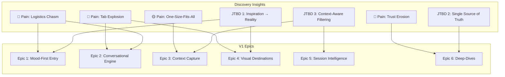

# 🧭 Wandr — V1 Feature Specification & User Stories

> **Product**: Wandr — AI-native travel discovery platform
> **Version**: V1 (MVP)
> **Date**: August 2, 2026
> **Input**: [Product Discovery Report](file:///C:/Users/Faizan/.gemini/antigravity/brain/91b19e9e-11c8-4ead-9063-2422273e3053/product_discovery.md)

---

## V1 Vision Statement

> Wandr V1 delivers a **complete discovery experience** for a single traveler — from *"I don't know where I want to go"* to *"I'm excited about this destination and know exactly why it's right for me."*

V1 does NOT handle booking, payments, or full itinerary generation. It nails the **discovery-to-conviction** journey so well that users are compelled to come back.

---

## V1 Scope Boundaries

| ✅ In Scope (V1) | ❌ Out of Scope (V2+) |
|---|---|
| Mood-first discovery entry | Booking integration (flights, hotels) |
| Conversational AI discovery | Full itinerary generation with day-by-day plans |
| Lightweight traveler context capture (per-session) | Persistent user accounts & auth |
| Visual destination cards with AI reasoning | Map-based visual exploration canvas |
| Evolving intent within a single session | Real-time data integration (weather, events, prices) |
| Destination deep-dives with grounded info | Group/multi-traveler support |
| Save & share discoveries (link-based) | Community/social features |
| | Payment & monetization infrastructure |

---

## Discovery-to-Feature Traceability

Every feature in V1 maps back to validated discovery insights:



---

## Epic 1: 🎭 Mood-First Discovery Entry

> *"I don't want a search engine; I want a curator."* — Sarah (The Dreamer)

**Purpose**: Replace the cold search bar with a warm, inviting entry point that captures traveler intent through mood, emotion, and vibe — not destinations and dates.

---

### Story 1.1 — Mood Prompt Entry

**As a** traveler who doesn't know where I want to go,
**I want to** describe what I'm feeling or craving in my own words,
**So that** the system understands my intent without forcing me into rigid filters.

**Priority**: P0 (Must-have)
**Personas**: All (primary: The Dreamer, The Spontaneous One)

**Acceptance Criteria**:
- [ ] Landing page presents an inviting open-ended prompt (e.g., *"What kind of escape are you dreaming of?"*)
- [ ] Free-text input accepts natural language of any length (min 3 words, no max)
- [ ] System processes input within 3 seconds and routes to conversational discovery
- [ ] Input field shows rotating example prompts to inspire users who are stuck:
  - *"I just finished a brutal quarter and need to completely unplug"*
  - *"My partner and I want somewhere romantic but not cliché"*
  - *"I want to eat my way through a country for under $2,000"*
  - *"Somewhere our kids will love but we won't be bored"*
- [ ] No required fields — user can start with as little as one sentence

**Discovery Insight**: Addresses the **Logistics Chasm** — most drop-off happens when users transition from dreaming to the "where exactly?" question. This bypasses it entirely.

---

### Story 1.2 — Visual Mood Selector (Alternative Entry)

**As a** traveler who finds it hard to articulate what I want,
**I want to** tap on visual mood tiles that resonate with me,
**So that** I can express my travel vibe without needing the right words.

**Priority**: P1 (Should-have)
**Personas**: The Dreamer, The Life-Stage Travelers

**Acceptance Criteria**:
- [ ] Grid of 8–12 mood tiles with evocative images + short labels:
  - 🏔️ *"Wild & Untamed"* | 🍷 *"Culture & Cuisine"* | 🏖️ *"Sun & Stillness"*
  - 🎒 *"Off the Grid"* | 🌃 *"City Buzz"* | ❄️ *"Cozy & Cold"*
  - 🎨 *"Art & Soul"* | 🌿 *"Slow & Grounded"* | 🎉 *"Social & Alive"*
  - 👨‍👩‍👧‍👦 *"Family Adventure"* | 💑 *"Romantic Escape"* | 🧘 *"Reset & Recharge"*
- [ ] User can select 1–3 tiles (multi-select)
- [ ] Tiles are visually rich (high-quality photography, subtle hover animations)
- [ ] Selection feeds directly into the conversational engine as structured intent
- [ ] Can be combined with free-text input (e.g., select "Culture & Cuisine" + type "but on a budget")

---

### Story 1.3 — Constraint Capture (Optional, Progressive)

**As a** traveler with real-world constraints,
**I want to** optionally add practical parameters (budget, dates, who's traveling),
**So that** recommendations are grounded in reality without being forced through a form.

**Priority**: P0 (Must-have)
**Personas**: All (primary: The Optimizer, The Life-Stage Travelers)

**Acceptance Criteria**:
- [ ] After mood input, system asks 1–2 natural follow-up questions (not a form):
  - *"Any idea on timing?"* → flexible date picker or "I'm flexible"
  - *"Who's coming along?"* → solo / couple / friends / family with kids / group
  - *"Any budget range in mind?"* → spectrum slider or "surprise me"
- [ ] ALL constraint fields are **optional** — skipping any is easy and judgment-free
- [ ] Constraints captured via conversational UI, not a traditional form
- [ ] System works with zero constraints (pure mood-based discovery is valid)
- [ ] Constraints can be modified at any point during the conversation

**Discovery Insight**: Raj (The Optimizer) needs constraints to trust results. Sarah (The Dreamer) needs to skip them without friction. This progressive, optional approach serves both.

---

## Epic 2: 💬 Conversational Discovery Engine

> *"I waste roughly 20 hours just verifying data. I need to see the logic."* — Raj (The Optimizer)

**Purpose**: The AI companion that understands context, asks smart questions, surfaces destinations with reasoning, and evolves with the conversation.

---

### Story 2.1 — Initial Discovery Response

**As a** traveler who just expressed my mood/intent,
**I want to** receive 3–4 thoughtfully curated destination suggestions with clear reasoning,
**So that** I can see options that feel personally chosen, not algorithmically generic.

**Priority**: P0 (Must-have)
**Personas**: All

**Acceptance Criteria**:
- [ ] AI responds with 3–4 destination suggestions (not a list of 10+)
- [ ] Each suggestion includes:
  - Destination name and region
  - 2–3 sentence explanation of **why it matches the user's stated intent**
  - One "hook" — a surprising or lesser-known fact that sparks curiosity
  - A visual card (see Epic 4)
- [ ] Suggestions span a diversity of options (e.g., not 3 beach destinations — vary by type, region, budget)
- [ ] Response time under 5 seconds
- [ ] AI explicitly invites reaction: *"Any of these spark something? Or should I explore a different direction?"*

**Example**:
```
You: "I want to unplug for a week — somewhere with nature 
      and good food, not too touristy"

Wandr: I love this brief. Here are three very different 
       directions:

🏔️ The Azores, Portugal — Volcanic islands in the mid-Atlantic 
   with dramatic crater lakes, natural hot springs, and a 
   food scene built around volcanic-cooked stews. September 
   is shoulder season — you'll practically have the trails 
   to yourself.

🍷 Puglia, Italy — Skip the Amalfi crowds. Puglia has 
   the same Mediterranean magic but with trulli stone houses, 
   $3 wine, and grandmothers making orecchiette on their 
   doorsteps. Truly the anti-tourist Italy.

🌿 Luang Prabang, Laos — A UNESCO town where monks walk 
   at dawn, waterfalls are turquoise, and a full day costs 
   $30. The definition of unplugging.

What pulls you? Or should I shift the vibe?
```

---

### Story 2.2 — Smart Follow-Up Questions

**As a** traveler exploring options,
**I want** the AI to ask me intelligent follow-up questions that narrow results meaningfully,
**So that** I don't have to figure out the right questions to ask myself.

**Priority**: P0 (Must-have)
**Personas**: All (primary: The Dreamer — needs guided narrowing)

**Acceptance Criteria**:
- [ ] AI asks follow-ups that are:
  - **Specific** (not "tell me more about your preferences")
  - **Binary or low-effort** (not essay questions)
  - **Contextual** to what the user already said
- [ ] Follow-ups help refine on dimensions like:
  - Adventure vs. relaxation spectrum
  - Cultural immersion depth
  - Comfort level (backpacker → boutique → luxury)
  - Pace preference (packed schedule → slow mornings)
  - Deal-breakers (long flights, extreme heat, altitude)
- [ ] AI never asks more than 2 questions in sequence without providing new suggestions
- [ ] User can ignore follow-ups and steer the conversation freely

---

### Story 2.3 — Conversational Pivot Handling

**As a** traveler whose preferences shift mid-conversation,
**I want** the AI to gracefully adapt when I change direction,
**So that** I don't feel locked into my initial input.

**Priority**: P0 (Must-have)
**Personas**: All (primary: The Spontaneous One)

**Acceptance Criteria**:
- [ ] AI detects intent shifts (e.g., "Actually, I'm thinking beaches instead of mountains")
- [ ] AI acknowledges the pivot naturally: *"Love the pivot! Let me rethink with beaches in mind..."*
- [ ] New suggestions reflect the updated intent while retaining earlier context that wasn't contradicted
- [ ] AI does NOT restart the conversation from scratch
- [ ] Conversation history remains visible and scrollable

**Discovery Insight**: Mika (The Spontaneous One) changes her mind fast. The system must feel like a flexible conversation, not a form that needs to be re-submitted.

---

### Story 2.4 — Transparent AI Reasoning

**As a** data-driven traveler,
**I want to** understand WHY the AI is recommending each destination,
**So that** I can trust the recommendations and make informed decisions.

**Priority**: P0 (Must-have)
**Personas**: The Optimizer (primary), all others (secondary)

**Acceptance Criteria**:
- [ ] Each recommendation includes a "Why this matches you" explanation tied to the user's stated preferences
- [ ] AI cites the basis for claims (e.g., *"Based on traveler reviews..."*, *"Historically, September sees 60% fewer tourists..."*)
- [ ] User can ask "why?" about any specific recommendation and get a deeper explanation
- [ ] AI acknowledges limitations honestly: *"I'm less certain about the food scene here — you might want to verify on local food blogs"*
- [ ] No black-box recommendations — every suggestion has a traceable chain of reasoning

**Discovery Insight**: This directly addresses the #1 deal-breaker for The Optimizer: *"Black-box AI recommendations. If it doesn't show me WHY, I won't trust it."* Also addresses the app review finding that AI hallucinations are a top complaint.

---

## Epic 3: 🧬 Traveler Context Capture

> *"Travel sites think 'family-friendly' means a kids' club and a Mickey Mouse pool."* — David (Life-Stage Traveler)

**Purpose**: Capture enough about the traveler's context — within the session, without registration — to power meaningfully different recommendations.

---

### Story 3.1 — Life Context Detection

**As a** traveler with specific life circumstances,
**I want** the AI to understand my context (solo, couple, family, remote worker, etc.),
**So that** recommendations account for my real-world constraints.

**Priority**: P0 (Must-have)
**Personas**: All (primary: Life-Stage Travelers)

**Acceptance Criteria**:
- [ ] AI infers traveler context from natural conversation cues:
  - *"traveling with my partner"* → couple mode (romance, shared interests)
  - *"we have a 4-year-old"* → family mode (safety, nap schedules, kid-friendly logistics)
  - *"I'll be working remotely"* → digital nomad mode (WiFi quality, coworking, time zones)
  - *"first time traveling solo"* → solo mode (safety, social hostels, walkability)
- [ ] Inferred context visibly affects recommendations (user can see the difference)
- [ ] User can correct misinterpretations: *"Actually, the kids aren't coming this time"*
- [ ] Context adjustments take effect immediately on subsequent suggestions

---

### Story 3.2 — Travel Style Calibration

**As a** traveler with a particular travel personality,
**I want** the AI to calibrate to my style within a few exchanges,
**So that** I stop getting generic suggestions and start getting ones that feel like me.

**Priority**: P1 (Should-have)
**Personas**: All

**Acceptance Criteria**:
- [ ] AI detects travel style signals from conversation:
  - Budget language → adjusts price tier of suggestions
  - Adventure language → shifts toward active, off-grid options
  - Comfort language → shifts toward boutique, curated experiences
  - Food mentions → elevates culinary experiences in recommendations
- [ ] After 3+ exchanges, AI explicitly reflects back its understanding: *"So you're looking for something adventurous but with good food, around $150/day, and you hate big tourist groups — am I reading you right?"*
- [ ] User can confirm or correct the profile summary
- [ ] Style calibration persists throughout the session

---

### Story 3.3 — Negative Preference Capture

**As a** traveler who knows what I DON'T want,
**I want to** express deal-breakers and have them respected,
**So that** I don't waste time on suggestions I'll immediately dismiss.

**Priority**: P0 (Must-have)
**Personas**: All (primary: The Spontaneous One — *"If it recommends the Hard Rock Cafe, I'm deleting the app"*)

**Acceptance Criteria**:
- [ ] AI captures explicit negatives: *"No beach resorts"*, *"Nothing in Asia"*, *"I can't do high altitude"*
- [ ] AI captures implicit negatives from dismissals: if a user dismisses 2 beach suggestions, AI stops suggesting beaches
- [ ] Captured negatives are never violated in subsequent suggestions
- [ ] AI can ask clarifying questions: *"When you say 'not touristy,' do you mean fewer crowds or more authentic local culture?"*

---

## Epic 4: 🃏 Visual Destination Experience

> *"I want to feed it my Instagram 'Saved' folder and have it say: 'Here is the exact trip.'"* — Sarah (The Dreamer)

**Purpose**: Transform AI text suggestions into rich, visual, swipeable destination cards that feel like scrolling through a travel feed, not reading search results.

---

### Story 4.1 — Destination Cards

**As a** traveler evaluating options,
**I want** each suggested destination presented as a rich visual card,
**So that** I can quickly gauge the vibe and feel excited — not just informed.

**Priority**: P0 (Must-have)
**Personas**: All (primary: The Dreamer)

**Acceptance Criteria**:
- [ ] Each destination suggestion renders as a visual card containing:
  - Hero image (high-quality, evocative photography)
  - Destination name + country/region
  - 1-line "vibe tag" (e.g., *"Volcanic islands, zero crowds, slow food"*)
  - AI match reason (1 sentence — why this fits YOUR mood/context)
  - Quick stats: best time to visit | avg daily cost | flight time from user's region
- [ ] Cards are visually stunning — modern design, smooth transitions
- [ ] Cards are interactable: tap to expand (deep-dive), swipe/dismiss, or save
- [ ] Multiple cards appear in a horizontal scroll or stacked layout within the chat
- [ ] Cards load with a subtle entrance animation (not jarring, not slow)

---

### Story 4.2 — Card Reactions (Like / Dismiss / Save)

**As a** traveler browsing suggestions,
**I want to** quickly react to destination cards (interested / not interested / save for later),
**So that** the AI learns my preferences from my reactions, not just my words.

**Priority**: P0 (Must-have)
**Personas**: All

**Acceptance Criteria**:
- [ ] Each card has 3 interaction options:
  - ❤️ **Interested** — signals positive preference, AI notes this
  - ✖️ **Not for me** — signals negative preference, AI adapts
  - 🔖 **Save** — adds to a "Saved Destinations" collection within the session
- [ ] AI uses reactions to refine subsequent suggestions (see Epic 5)
- [ ] Dismissing a card triggers a one-time optional micro-question: *"Too expensive? Too far? Not the vibe?"* (dismissible)
- [ ] Saved destinations are accessible via a persistent side panel or tab
- [ ] Reaction interactions are lightweight (single tap, no confirmation dialogs)

---

### Story 4.3 — Side-by-Side Comparison

**As a** traveler narrowing down between 2–3 options,
**I want to** compare destinations side-by-side on dimensions I care about,
**So that** I can make a confident final decision without opening 10 tabs.

**Priority**: P1 (Should-have)
**Personas**: The Optimizer (primary), The Life-Stage Travelers

**Acceptance Criteria**:
- [ ] User can select 2–3 saved/liked destinations and trigger comparison view
- [ ] Comparison table shows:
  - Visual side-by-side (hero images)
  - Budget comparison (avg daily cost)
  - Best season / weather at travel dates
  - Travel time from user's location
  - Vibe match score (how well it fits stated intent)
  - Key differentiators (what makes each unique)
- [ ] AI provides a brief synthesis: *"If food is your priority, Puglia wins. If you want total isolation, the Azores edge it."*
- [ ] Comparison is shareable as a link

---

## Epic 5: 🔄 Evolving Session Intelligence

> *"If it gets too complicated, I sometimes just cancel the flight within the 24-hour window."* — Mika (The Spontaneous One)

**Purpose**: The AI gets meaningfully smarter within a single session — learning from every message, reaction, and behavioral signal to surface increasingly relevant results.

---

### Story 5.1 — Reaction-Based Learning

**As a** traveler who reacts to suggestions,
**I want** the AI to visibly improve its recommendations based on my reactions,
**So that** I feel the system is learning ME, not just processing queries.

**Priority**: P0 (Must-have)
**Personas**: All

**Acceptance Criteria**:
- [ ] AI tracks all signals within the session:
  - Cards liked/dismissed and why
  - Topics the user asks follow-ups about (signals interest)
  - Explicit preference statements
  - Implied preferences from language patterns
- [ ] After 4+ interactions, recommendations are noticeably more targeted
- [ ] AI occasionally acknowledges its learning: *"I'm noticing you're drawn to places with strong culinary identity — let me lean into that..."*
- [ ] User can reset: *"Start fresh"* clears session context

---

### Story 5.2 — Intent Crystallization Detection

**As a** traveler whose intent starts vague and sharpens over time,
**I want** the AI to detect when my preferences have crystallized,
**So that** it shifts from broad exploration to deep support for my chosen direction.

**Priority**: P1 (Should-have)
**Personas**: All

**Acceptance Criteria**:
- [ ] AI detects crystallization signals:
  - User asks detailed questions about one specific destination
  - User saves a destination and asks "tell me more"
  - User explicitly narrows: *"I think I want to go to Portugal"*
- [ ] AI shifts tone from exploration to activation:
  - *"It sounds like the Azores are calling you! Want me to go deeper — best time to visit, where to stay, what to eat?"*
- [ ] Transition is smooth — no jarring mode switch
- [ ] User can always return to exploration mode: *"Actually, show me more options"*

---

### Story 5.3 — Session Continuity (Return Within 48h)

**As a** traveler who needs time to think,
**I want to** come back within 48 hours and pick up where I left off,
**So that** I don't have to re-explain my preferences.

**Priority**: P1 (Should-have)
**Personas**: All (primary: The Optimizer — spends weeks deciding)

**Acceptance Criteria**:
- [ ] Sessions are persisted via a unique shareable URL (no auth required)
- [ ] Returning to the URL within 48 hours restores:
  - Full conversation history
  - Saved destinations
  - Learned preferences and context
- [ ] AI greets returning users naturally: *"Welcome back! Last time you were excited about the Azores and Puglia. Want to pick up there, or explore something new?"*
- [ ] Sessions expire after 48 hours (V1 scope — persistent profiles are V2)
- [ ] User can explicitly start a new session at any time

---

## Epic 6: 🔍 Destination Deep-Dive

> *"We don't need more beautiful photos; we need to know exactly which bus terminal to go to."* — Lonely Planet app reviewers

**Purpose**: When a traveler says "tell me more," deliver a rich, trustworthy deep-dive that makes them feel confident — not overwhelmed.

---

### Story 6.1 — Destination Overview

**As a** traveler interested in a specific destination,
**I want** a comprehensive but scannable overview,
**So that** I can quickly evaluate if this place is genuinely right for me.

**Priority**: P0 (Must-have)
**Personas**: All

**Acceptance Criteria**:
- [ ] Tapping "Tell me more" on any destination card opens a rich deep-dive view with:
  - **Hero visual** — gallery of 4–6 high-quality images
  - **AI summary** — 2–3 paragraph overview written in Wandr's voice, tailored to the user's stated interests
  - **Best for** — tags showing what type of traveler/trip this suits
  - **Best time to visit** — month-by-month breakdown with reasoning
  - **Budget guide** — realistic daily cost ranges (budget / mid-range / comfort)
  - **Getting there** — flight time from user's region, visa requirements
  - **Vibe check** — honest pros AND cons (not just marketing)
- [ ] Content is grounded in hybrid data (curated knowledge + sourced claims)
- [ ] Deep-dive loads within 3 seconds
- [ ] User can scroll or collapse sections

---

### Story 6.2 — "Why You'll Love It" / "What to Know" Sections

**As a** traveler who wants honesty, not marketing,
**I want** the AI to tell me both why I'll love a destination AND what might be challenging,
**So that** I can make decisions based on reality, not hype.

**Priority**: P0 (Must-have)
**Personas**: All (primary: The Optimizer, The Life-Stage Travelers)

**Acceptance Criteria**:
- [ ] Deep-dive includes two clearly labeled sections:
  - ✅ **"Why You'll Love It"** — personalized to user's stated intent (not generic)
  - ⚠️ **"What to Know"** — honest considerations (e.g., *"The rainy season starts in October"*, *"English isn't widely spoken outside the capital"*, *"Not ideal for strollers — lots of cobblestones"*)
- [ ] "What to Know" section is specific to the user's context (e.g., family travelers see stroller/kid info; solo female travelers see safety info)
- [ ] AI cites sources for factual claims where possible
- [ ] Tone is honest and helpful, never alarmist

**Discovery Insight**: Directly addresses trust erosion. David (Life-Stage Traveler): *"If an app tells me a hiking trail is 'easy and stroller-friendly' and it turns out to be rocky, my whole day is ruined."* Also addresses the app review finding that AI review summaries hide negatives.

---

### Story 6.3 — Experience Highlights

**As a** traveler exploring a destination,
**I want to** see curated experience highlights (not a list of 100 things to do),
**So that** I get a feel for what my days might look like without being overwhelmed.

**Priority**: P1 (Should-have)
**Personas**: All

**Acceptance Criteria**:
- [ ] Deep-dive includes 5–8 curated experience highlights tailored to user's interests:
  - Each highlight: title + 1-sentence description + category tag (food, nature, culture, adventure)
  - Highlights are contextualized: *"Since you mentioned food, don't miss..."*
- [ ] Experiences are a mix of must-sees and hidden gems (not just the top TripAdvisor attractions)
- [ ] AI explains why each experience was selected for THIS user
- [ ] Experiences are NOT an exhaustive list — they're a curated "trailer" of what the trip could feel like

---

### Story 6.4 — Share & Save Discovery

**As a** traveler excited about a destination,
**I want to** save it to my session collection and share it with my travel partner,
**So that** I can discuss options and make a group decision.

**Priority**: P1 (Should-have)
**Personas**: All (primary: The Optimizer, The Life-Stage Travelers)

**Acceptance Criteria**:
- [ ] "Save" button adds destination to session collection with deep-dive data
- [ ] "Share" generates a unique link that opens a read-only view of:
  - The destination deep-dive
  - The AI's personalized reasoning for why it was recommended
  - The comparison view (if multiple destinations are saved)
- [ ] Shared link works without login or app install
- [ ] Share options: copy link, WhatsApp, iMessage, email
- [ ] Shared view includes a CTA: *"Start your own Wandr discovery →"*

---

## Feature × Persona Coverage Matrix

| Feature | 🎭 Dreamer (Sarah) | 🔬 Optimizer (Raj) | ⚡ Spontaneous (Mika) | 👨‍👩‍👧‍👦 Family (David & Priya) |
|---|:---:|:---:|:---:|:---:|
| Mood prompt entry | ★★★ | ★★ | ★★★ | ★★ |
| Visual mood selector | ★★★ | ★ | ★★ | ★★★ |
| Constraint capture | ★ | ★★★ | ★ | ★★★ |
| Initial discovery response | ★★★ | ★★★ | ★★★ | ★★★ |
| Smart follow-ups | ★★★ | ★★ | ★★ | ★★★ |
| Pivot handling | ★★ | ★ | ★★★ | ★ |
| Transparent reasoning | ★ | ★★★ | ★ | ★★★ |
| Life context detection | ★ | ★★ | ★★ | ★★★ |
| Travel style calibration | ★★ | ★★ | ★★★ | ★★ |
| Negative preference capture | ★ | ★★ | ★★★ | ★★ |
| Destination cards | ★★★ | ★★ | ★★★ | ★★ |
| Card reactions | ★★★ | ★★ | ★★★ | ★★ |
| Side-by-side comparison | ★ | ★★★ | ★ | ★★★ |
| Reaction-based learning | ★★★ | ★★ | ★★ | ★★ |
| Intent crystallization | ★★★ | ★★ | ★ | ★★ |
| Session continuity | ★★ | ★★★ | ★ | ★★★ |
| Destination deep-dive | ★★ | ★★★ | ★ | ★★★ |
| Honest pros & cons | ★ | ★★★ | ★★ | ★★★ |
| Experience highlights | ★★★ | ★★ | ★★★ | ★★ |
| Share & save | ★★ | ★★★ | ★ | ★★★ |

*★★★ = Primary value, ★★ = Secondary value, ★ = Minimal direct value*

---

## Priority Summary

### P0 — Must Ship (Core Experience)

| # | Story | Epic |
|---|---|---|
| 1.1 | Mood Prompt Entry | Mood-First Entry |
| 1.3 | Constraint Capture (Optional) | Mood-First Entry |
| 2.1 | Initial Discovery Response (3–4 suggestions with reasoning) | Conversational Engine |
| 2.2 | Smart Follow-Up Questions | Conversational Engine |
| 2.3 | Conversational Pivot Handling | Conversational Engine |
| 2.4 | Transparent AI Reasoning | Conversational Engine |
| 3.1 | Life Context Detection | Context Capture |
| 3.3 | Negative Preference Capture | Context Capture |
| 4.1 | Destination Cards | Visual Experience |
| 4.2 | Card Reactions (Like/Dismiss/Save) | Visual Experience |
| 5.1 | Reaction-Based Learning | Session Intelligence |
| 6.1 | Destination Overview Deep-Dive | Deep-Dive |
| 6.2 | Honest "Why You'll Love It" / "What to Know" | Deep-Dive |

### P1 — Should Ship (Differentiators)

| # | Story | Epic |
|---|---|---|
| 1.2 | Visual Mood Selector | Mood-First Entry |
| 3.2 | Travel Style Calibration | Context Capture |
| 4.3 | Side-by-Side Comparison | Visual Experience |
| 5.2 | Intent Crystallization Detection | Session Intelligence |
| 5.3 | Session Continuity (48h return) | Session Intelligence |
| 6.3 | Experience Highlights | Deep-Dive |
| 6.4 | Share & Save Discovery | Deep-Dive |

### P2 — Nice-to-Have (Polish)

| # | Story | Epic |
|---|---|---|
| — | Animated card transitions | Visual Experience |
| — | Typing indicator with personality | Conversational Engine |
| — | "Surprise Me" random discovery | Mood-First Entry |
| — | Conversation export (PDF) | Deep-Dive |

---

## Technical Considerations (For Architecture Planning)

> [!NOTE]
> These are surface-level notes to inform the next step (technical architecture). Not prescriptive.

| Concern | Consideration |
|---|---|
| **AI Model** | Needs strong conversational ability + factual grounding. Multi-turn context window is critical. |
| **Grounding Strategy** | Hybrid: curated destination knowledge base + real-time web grounding + community sentiment. RAG architecture likely. |
| **Session State** | Must persist conversation context, reactions, and inferred preferences across messages. Stateful backend. |
| **Image Pipeline** | Destination images need to be high-quality, licensed, and fast-loading. CDN + pre-cached galleries. |
| **Latency** | Initial response under 5s, follow-ups under 3s. Streaming responses will be important for perceived speed. |
| **Platform** | Web-first (responsive). No native app for V1. PWA potential for V2. |

---

## Success Metrics (V1)

| Metric | Target | Why It Matters |
|---|---|---|
| **Session depth** | Avg 6+ messages per session | Users are engaged, not bouncing after first response |
| **Destination saves** | 40%+ of sessions result in ≥1 save | Users found something they're genuinely excited about |
| **Return rate** | 25%+ of users return within 7 days | Discovery experience is sticky |
| **Share rate** | 15%+ of sessions result in a shared link | Word-of-mouth growth engine |
| **Session completion** | 60%+ reach a destination deep-dive | Users make it through the full discovery funnel |
| **NPS** | 50+ | Users love the experience enough to recommend it |

---

## Suggested Release Phases

| Phase | Scope | Goal |
|---|---|---|
| **Alpha** (Internal) | P0 features only, limited destinations (50) | Validate core discovery loop works end-to-end |
| **Beta** (Invite-only) | P0 + P1 features, expanded destinations (200+) | Validate with real travelers, measure metrics |
| **GA** (Public launch) | All P0 + P1 + select P2 polish | Public launch with waitlist conversion |
